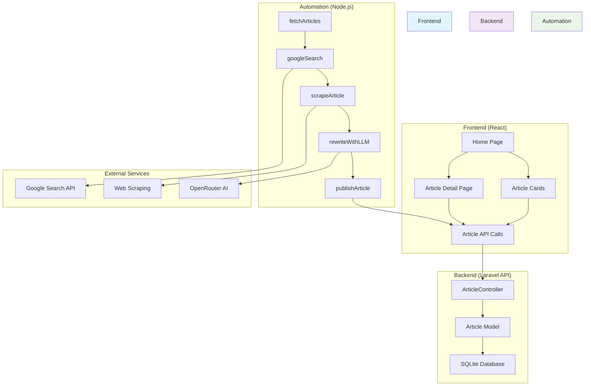
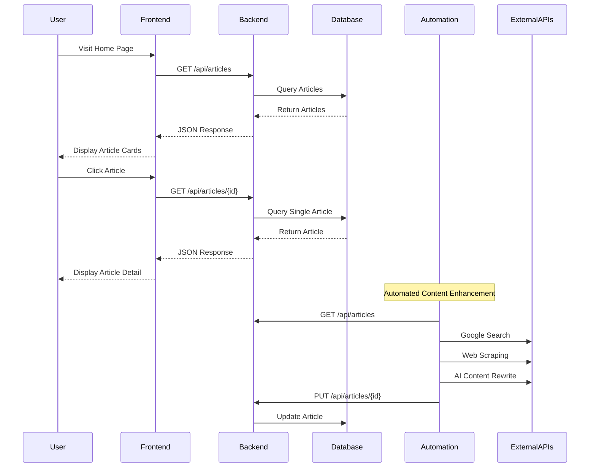

# BeyondChats Project

A comprehensive content management system featuring AI-powered article processing, automation, and a modern web interface for displaying articles.

## Project Overview

BeyondChats consists of three main components:
- **Backend**: Laravel API server for article management
- **Frontend**: React web application for displaying articles
- **Automation**: Node.js script for AI-powered content enhancement

## Architecture Diagram



## Data Flow Diagram



## Local Setup Instructions

### Prerequisites

- **Node.js** (v18 or higher)
- **PHP** (v8.2 or higher)
- **Composer** (latest version)
- **Git**

### 1. Backend Setup (Laravel)

```bash
# Navigate to backend directory
cd backend

# Install PHP dependencies
composer install

# Copy environment file
cp .env.example .env

# Generate application key
php artisan key:generate

# Set up database (SQLite by default)
php artisan migrate

# Scrape articles from BeyondChats website to populate the database
php artisan scrape:beyondchats

# Start the development server
php artisan serve
```

The backend API will be available at `http://localhost:8000`

### 2. Frontend Setup (React)

```bash
# Navigate to frontend directory
cd frontend

# Install Node.js dependencies
npm install

# Create environment file (optional)
echo "VITE_API_BASE_URL=http://localhost:8000/api" > .env

# Start the development server
npm run dev
```

The frontend will be available at `http://localhost:5173`

### 3. Automation Setup (Node.js)

```bash
# Navigate to automation directory
cd beyondchats-automation

# Install Node.js dependencies
npm install

# Configure environment variables
```

**Required Environment Variables for Automation:**

Create a `.env` file in the `beyondchats-automation` directory:

```env
BACKEND_API=http://localhost:8000/api
OPENROUTER_API_KEY=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
OPENROUTER_SITE_URL=http://localhost
OPENROUTER_SITE_NAME=BeyondChats Automation
SERPER_API_KEY=540f4fc28bdbff96ec0676c5947b1154f6295c0d
```

**To get API keys:**
- **OpenRouter API Key**: Sign up at [OpenRouter.ai](https://openrouter.ai/)
- **Serper API Key**: Sign up at [Serper.dev](https://serper.dev/)

### 4. Run the Automation Script

```bash
cd beyondchats-automation
npm run dev
```

This script will:
1. Fetch articles from the backend
2. Search for related content using Google Search
3. Scrape external articles for references
4. Rewrite content using AI
5. Update articles in the backend with enhanced content

## Project Structure

```
beyondchats/
├── backend/                    # Laravel API
│   ├── app/
│   │   ├── Http/Controllers/Api/
│   │   │   └── ArticleController.php
│   │   └── Models/
│   │       └── Article.php
│   ├── database/
│   │   └── migrations/
│   ├── routes/
│   │   └── api.php
│   └── .env.example
├── frontend/                   # React Application
│   ├── src/
│   │   ├── api/
│   │   │   └── articles.js
│   │   ├── components/
│   │   │   ├── ArticleCard.jsx
│   │   │   └── ArticleTabs.jsx
│   │   ├── pages/
│   │   │   ├── Home.jsx
│   │   │   └── ArticleDetail.jsx
│   │   └── App.jsx
│   └── package.json
└── beyondchats-automation/     # Node.js Automation
    ├── src/
    │   ├── index.js
    │   ├── fetchArticles.js
    │   ├── googleSearch.js
    │   ├── scrapeArticle.js
    │   ├── rewriteWithLLM.js
    │   └── publishArticle.js
    └── package.json
```

## API Endpoints

### Articles API

- **GET** `/api/articles` - Get all articles
- **GET** `/api/articles/{id}` - Get a specific article
- **POST** `/api/articles` - Create a new article
- **PUT** `/api/articles/{id}` - Update an article
- **DELETE** `/api/articles/{id}` - Delete an article

### Article Model Schema

```json
{
  "id": 1,
  "title": "Article Title",
  "content": "Original content...",
  "updated_content": "AI-enhanced content...",
  "source_url": "https://example.com/source",
  "type": "original|updated",
  "references": [
    {
      "url": "https://example.com/ref1",
      "title": "Reference Title 1"
    }
  ],
  "isUpdated": true,
  "created_at": "2024-01-01T00:00:00.000000Z",
  "updated_at": "2024-01-01T00:00:00.000000Z"
}
```

## Technology Stack

### Backend
- **Laravel 12.0** - PHP Framework
- **SQLite** - Database
- **PHPUnit** - Testing

### Frontend
- **React 19.2.0** - UI Framework
- **React Router 7.11.0** - Routing
- **Axios 1.13.2** - HTTP Client
- **TailwindCSS 3.4.19** - Styling
- **Vite 7.2.4** - Build Tool

### Automation
- **Node.js** - Runtime
- **Axios 1.13.2** - HTTP Client
- **Cheerio 1.1.2** - Web Scraping
- **OpenAI 6.15.0** - AI Integration
- **Dotenv 17.2.3** - Environment Management

## Development Workflow

1. **Start Backend**: `cd backend && php artisan serve`
2. **Start Frontend**: `cd frontend && npm run dev`
3. **Run Automation**: `cd beyondchats-automation && npm run dev`

The automation script can be run periodically to enhance existing articles with AI-generated content and external references.

## Features

- **Article Management**: CRUD operations for articles
- **AI Content Enhancement**: Automated content rewriting with external references
- **Modern UI**: Responsive React frontend with TailwindCSS
- **RESTful API**: Well-structured Laravel API
- **Automation**: Scheduled content enhancement workflow

## Contributing

1. Fork the repository
2. Create a feature branch
3. Make your changes
4. Test thoroughly
5. Submit a pull request
